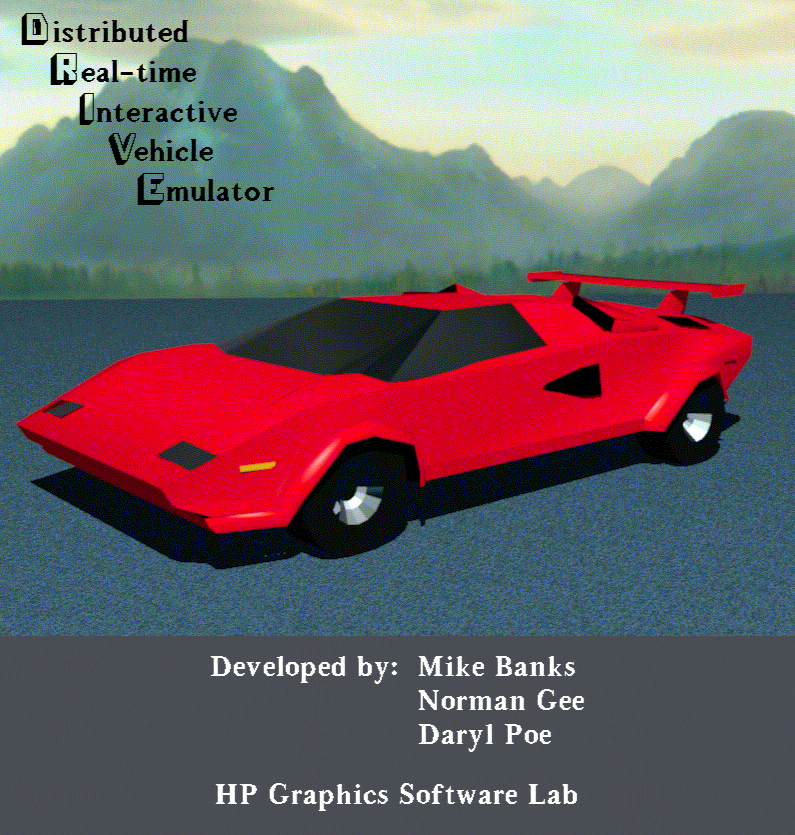

DRIVE -- the Distributed Real-time Interactive Vehicle Emulator, HP's
multi-player driving simulator for the series 9000 workstations.

Developed by Mike Banks, Norman Gee and Daryl Poe of the HP Graphics
Software Lab.  It was written originally for HP Starbase and later
ported to PEX, where it was known as PEXdrive.

WHERE THIS CAME FROM
====================

Upstream is the Hoverball project by Ross Cunniff on SourceForge:

    https://sourceforge.net/p/hoverball/git/ci/master/tree/HB_HW/
    git clone https://git.code.sf.net/p/hoverball/git

Forked from commit 9299b78 of 17 Sep 2026.  DRIVE is (c) Hewlett-Packard
Company, released under the GPL v2; see COPYING.txt and LICENSE.TXT.
Parts also carry Daryl Poe's own copyright.

Upstream targets HP-UX, Linux/X11 with Motif, and Win32.  This fork
builds and runs on current macOS, Linux and Windows with GLFW, and keeps
only DRIVE and the HoverWare pieces it needs.

This tree is DRIVE plus the parts of HoverWare (HW) it needs:

        DRIVE     the simulator, client and server
        HW        HoverWare, the graphics library DRIVE draws with
        JPEG      Independent JPEG Group release 6b, for HW textures
        LIBPNG    PNG readers/writers linked into the HW libraries
        PDCURSES  PDCurses 3.9 wincon, the server console on Windows

GLFW comes from the system, and so does curses everywhere but Windows.
The Hoverball game and the bundled GLFW, FreeType and OpenAL sources are
not needed to build DRIVE and have been removed.

BUILDING DRIVE ON MODERN SYSTEMS
================================

    ./build.macos.sh    -- macOS (clang, Homebrew GLFW, arm64 or x86_64)
    ./build.linux.sh    -- Linux (gcc, system GLFW)
    ./build.windows.sh  -- Windows, in an MSYS2 MINGW64 shell

They produce DRIVE/drive and DRIVE/drive_server, .exe on Windows.  Linux
needs build-essential, libglfw3-dev, libgl1-mesa-dev and libncurses-dev;
Windows needs mingw-w64-x86_64-gcc, mingw-w64-x86_64-glfw and make.
The scripts just chain the JPEG, LIBPNG, HW and DRIVE makefiles, so
individual pieces can also be rebuilt with "make -f OSX_GLFW.mk",
"make -f Linux_GLFW.mk" or "make -f Mingw_GLFW.mk" in those directories.
Object files are not tagged by platform, so delete them before building
the same tree for another one.

The Windows binaries are statically linked and need nothing installed.
The client has no console; the server wants a real one, so run it from
cmd or Windows Terminal rather than from mintty.  drive.exe on its own
expects a server to already be running, so start it with one of the .bat
files rather than by double-clicking it.

Launcher scripts in the top-level directory:

    ./run.sh          server console + client, normal race cycle
    ./justdrive.sh    unlimited practice, car already spawned
    run.bat           the same two, for Windows outside MSYS2
    justdrive.bat

justdrive.sh runs the server hidden inside the game, so there is one
window and no console; run.sh still opens the operator console.
justdrive.sh takes an optional vehicle name, e.g. ./justdrive.sh "Tank".
Steer with the mouse (up accelerates, down brakes); "r" respawns and "?"
shows the keyboard help.

The menu bar along the bottom is the original one: Vehicle (choose vehicle,
which returns to the spinning picker with a clickable list of cars, and
automatic/manual transmission),
Config (depth cue: no / little / some / more / max fog, with the current
level ticked), Upright, Start Over, Quit and Help.

The server has a curses operator console.  NEXT STATE steps Pre-Race ->
Racing -> Post-Race -> Practice; cars can only be driven in Racing and
Practice.  Automatic Race Control runs that cycle unattended.

Environment variables: DRIVE_LOCAL_SERVER=1 makes the client start and
stop its own drive_server, with no console and no terminal of its own,
which the .app does by itself (DRIVE_NO_CONSOLE=1 and
DRIVE_EXIT_WHEN_EMPTY=1 do those two halves for a server run by hand);
DRIVE_PRACTICE_MODE=1 keeps the server in Practice with the clock
stopped; DRIVE_VEHICLE="<name>" plus DRIVE_AUTOSTART_MODE=1 skip the
client vehicle picker; DRIVE_WINDOW=WxH sets the window size (default
835x940, the original); DRIVE_FOG=<n> sets the starting depth cue level
(default 1.8, larger is hazier) and DISABLE_DEPTH_CUE=1 turns it off;
the Config menu changes it while driving.

PACKAGING
=========

    make app             build/DRIVE.app, ad-hoc signed
    make dmg             the same in build/DRIVE.dmg
    make release         Developer ID signed, notarized and stapled DMG
    make zip             build/DRIVE-windows-x64.zip, after build.windows.sh
    make tar             build/DRIVE-linux-x86_64.tar.gz, after build.linux.sh
    ./package.linux.sh   the same tarball, built portable in Docker

A double-clickable app with the server hidden inside it; it defaults to
unlimited practice, and GLFW is linked statically so nothing else has to
be installed.  "make release" needs DEV_ID and NOTARY_PROFILE in .env --
copy .env.example and fill them in.  The zip and the tarball are the two
binaries and their data with the launchers beside them.

"make tar" packages whatever the local build.linux.sh produced, which
will not run on anything older than the machine that built it.
package.linux.sh instead builds in an Ubuntu 20.04 container with GLFW
and curses linked statically, so its tarball needs only glibc 2.31 or
newer and the host's own libGL and libX11.

TESTING WITHOUT A DESKTOP
=========================

    ./headless.sh shot.png            build and run in Docker, save a frame
    ./headless.sh shot.png 160 465    click those window coordinates first

Runs the Linux build on an Xvfb virtual display with Mesa's software
renderer, so nothing appears on the desktop and input is synthetic.  The
build is cached in a docker volume, so only the first run is slow.
